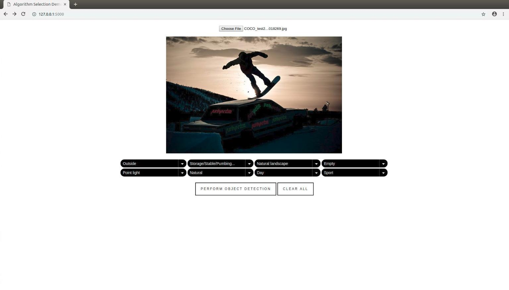
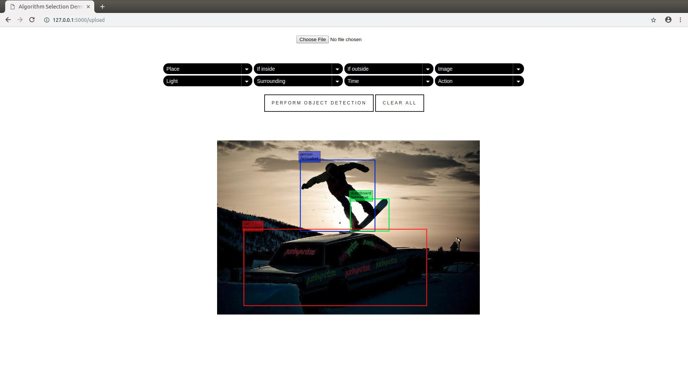

# Algorithm Selection Demo

## Installation

Clone the repository:

```bash
$ git clone https://github.com/alinoleumm/assv.git
```

Download pre-trained [algorithm selection stage I model](https://github.com/alinoleumm/assv/releases/download/v1.1/svc.sav), [algorithm selection stage II model](https://github.com/alinoleumm/assv/releases/download/v1.1/dt.sav) and [object histograms](https://github.com/alinoleumm/assv/releases/download/v1.1/object_histograms.tar.gz).

Indicate pathes to downloaded files [here](https://github.com/alinoleumm/assv/blob/master/main.py#L80-L82).

```python
...
cat_dir = '/path-to-object-histograms' 
wclf = joblib.load('/path-to-pretrained-as-I-model') 
iclf = joblib.load('/path-to-pretrained-as-II-model') 
...
```

## System usage

Run [main.py](https://github.com/alinoleumm/assv/blob/master/main.py):

```bash
$ python main.py
```

Upload the image and choose the relevant context.



Systems analyses the image and performs the object detection using the best performing algorithm.


