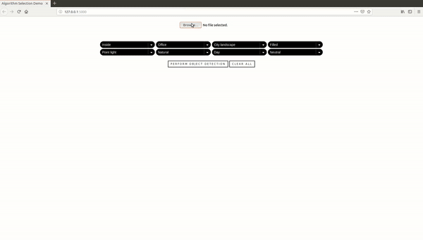

# Algorithm Selection Framework

Clone the repository:

```bash
$ git clone https://github.com/alinoleumm/assv.git
```

Install the requirements:

```bash
$ pip install -r requirements.txt
```

Download pre-trained [algorithm selection stage I model](https://github.com/alinoleumm/assv/releases/download/v1.1/svc.sav), [algorithm selection stage II model](https://github.com/alinoleumm/assv/releases/download/v1.1/dt.sav) and [object histograms](https://github.com/alinoleumm/assv/releases/download/v1.1/object_histograms.tar.gz).

Indicate pathes to downloaded files [here](https://github.com/alinoleumm/assv/blob/2324462ab954f1df88ed4e414e7f1d0ad7c7aeeb/main.py#L80-L82):

```python
cat_dir = '/path-to-object-histograms' 
wclf = joblib.load('/path-to-pretrained-as-I-model') 
iclf = joblib.load('/path-to-pretrained-as-II-model') 
```

Run [main.py](https://github.com/alinoleumm/assv/blob/master/main.py):

```bash
$ python main.py
```

This is a short [demo](https://www.dropbox.com/s/a46trqt7cwrvgm3/SP_DemoWithStageII.mp4?dl=0) of a system.


